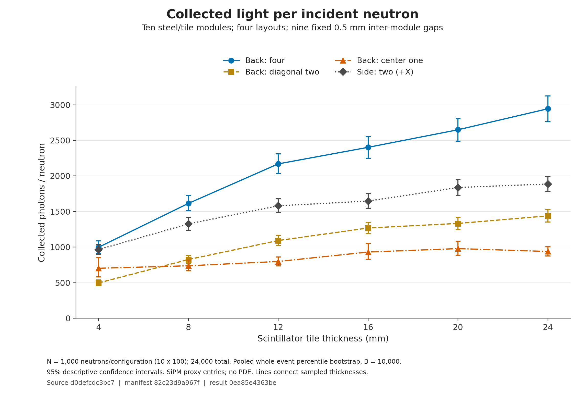
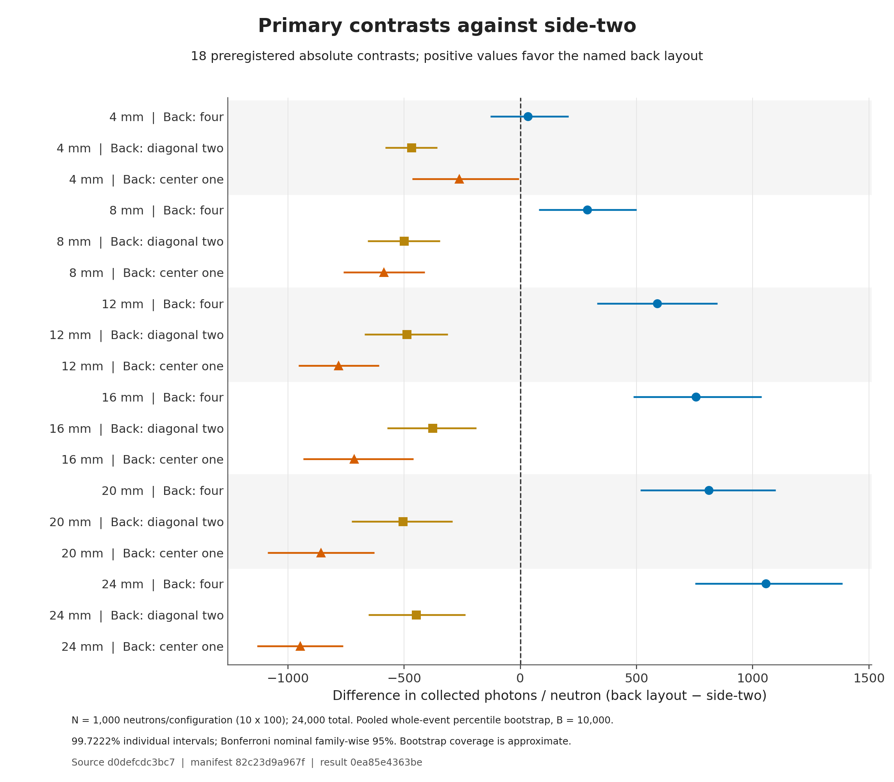
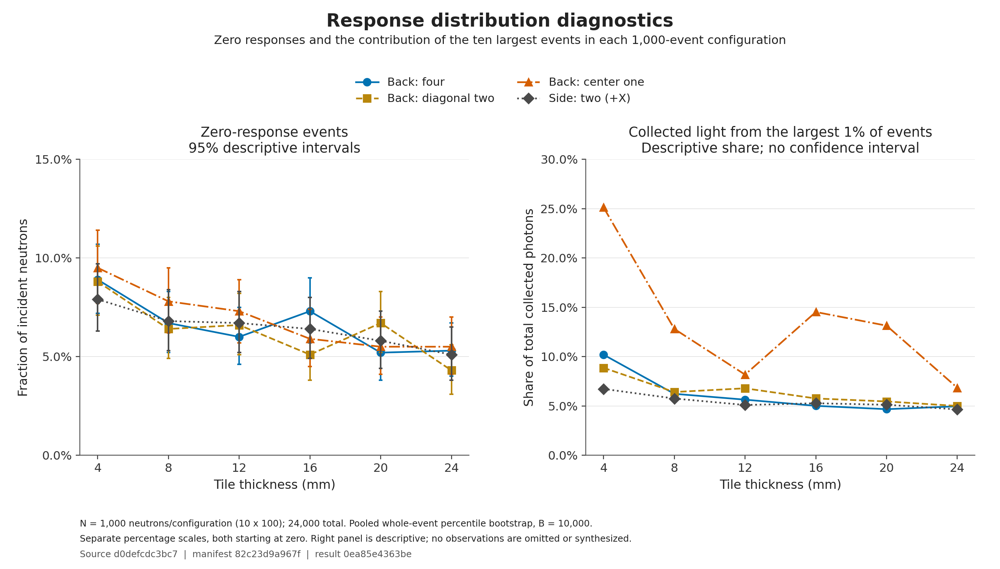

# First fixed sample: ten-layer steel / SiPM layouts

Completed on 2026-10-03: **24 configurations × 1,000 incident neutrons**, in 240 independent 100-event tasks. All tasks finished `COMPLETED / 0:0 / 1 CPU`; collection accepted every task before analysis. No simulation task was repeated, no events were removed, and no additional sample was chosen after viewing the results. This PR remains a draft for scientific review.

The simulation and statistical analysis used commit **`d0defcdc3bc7513b4feccdaa64a4512ea621c797`**. Later plotting/documentation commits do not change that version. The six thicknesses below are **scintillator tile thicknesses**; every steel plate remains 40 mm thick. All layouts use the same nine 0.5 mm inter-module gaps. See the [model and runtime guide](../../README.md) and [prespecified analysis](../../FIRST_SCAN.md).

## Collected-photon response



The primary endpoint is mean collected optical photons per incident neutron, including zero-response events. Back-four exceeds side-two in the prespecified absolute comparisons at 8–24 mm. At 4 mm, the adjusted difference interval includes zero; this does not establish equivalence.

| Tile thickness (mm) | Back-four mean | Side-two mean | Back-four minus side-two, adjusted interval | Relative point difference |
|---:|---:|---:|---:|---:|
| 4 | 997.9 | 965.9 | +32.0 [-127.8, +207.8] | +3.3% |
| 8 | 1614.3 | 1326.5 | +287.8 [+79.5, +500.7] | +21.7% |
| 12 | 2169.7 | 1580.9 | +588.8 [+329.6, +847.8] | +37.2% |
| 16 | 2402.2 | 1647.3 | +754.9 [+485.9, +1037.5] | +45.8% |
| 20 | 2648.8 | 1837.9 | +811.0 [+516.9, +1098.6] | +44.1% |
| 24 | 2943.9 | 1886.9 | +1057.1 [+751.7, +1385.9] | +56.0% |

Means and absolute differences are photons/neutron. The table's intervals have **99.7222% individual coverage**, using the prespecified Bonferroni nominal family-wise 95% target for all 18 primary contrasts. Bootstrap coverage is approximate. Relative percentages in this table are point estimates; their separate, descriptive 95% intervals are in [primary-contrasts.csv](primary-contrasts.csv).



The back diagonal pair and back-center sensor have lower mean total response than side-two at all six sampled thicknesses under these comparisons. The 4 mm back-center result is particularly sensitive to the tail: its upper adjusted difference bound is only −5.12 photons/neutron, and its ten largest events contribute 25.12% of collected light. With 10,000 bootstrap replicates, each adjusted tail uses about 14 replicates; avoid overstating the precision of this marginal interval.

## Interpretation boundaries

Back-four has twice side-two's nominal collection-face area (230.4 versus 115.2 mm² across ten layers). The total-response difference therefore combines sensor count, area and location. [Area-normalized response](area-normalized-response.png) is a descriptive comparison, not a causal separation of those effects. At 24 mm, for example, back-four's total mean is 2,943.9 versus side-two's 1,886.9 photons/neutron, while their area-normalized means are approximately 12.8 and 16.4 photons/neutron/mm².



Zero-response fractions range from 4.3% to 9.5%; all such events remain in the analysis. Recorded cross-layer collected-photon counts are exactly zero in this sample. These statements concern this model's counters. PDE, electronics, experimental material uncertainties and full optical birth/fate closure are outside this scan. The inherited NoRINDEX log check observes the first boundary, not every optical trajectory. The fixed sample does not guarantee a requested precision or identify a universally optimal detector.

## Reproduce the figures without rerunning Geant4

Use Python 3.9 or newer; the documented Docker image already includes Python. From the repository root, create a separate plotting environment:

```sh
python3 -m venv outputs/layout-plot-venv
. outputs/layout-plot-venv/bin/activate
python -m pip install -r tools/layout_study/requirements-plot.txt
python tools/layout_study/plot.py \
  --result tools/layout_study/results/first-scan-d0defcdc/source-result.json \
  --result-sha256 0ea85e4363beb04e4a29ef0e382d110994bd12c5667c780f0f01e47c5dbeb6ba \
  --output outputs/reproduced-first-scan-figures
```

Choose a new output directory for each run. The standalone `plot_program.py` copy in this folder also works with `source-result.json` and `requirements-plot.txt`; it never reads ROOT or resamples events. The [figure index](artifact-index.json) records the exact plotted input, plotting program and environment. Its automatic status says `rendered-awaiting-visual-review`; the completed rendered inspection is recorded separately in [validation-summary.json](validation-summary.json).

For a new simulation, check out the exact simulation commit above and follow [FORMAL_RUN.md at that commit](https://github.com/Driver066/g4optics/blob/d0defcdc3bc7513b4feccdaa64a4512ea621c797/tools/layout_study/FORMAL_RUN.md). Use the same 24 configurations and seed start `1800000001`. The 480 registered simulation seed values are distinct and excluded from the engineering and analysis seeds. Record your own paths, job IDs and runtime hashes. Those operational identities and ROOT serialization metadata may differ; cross-architecture bitwise identity is not assumed.

## Evidence and execution

- [Original analysis JSON](source-result.json), [exact configuration table](configuration-summary.csv), [all contrasts](primary-contrasts.csv), and [ten block means per configuration](block-means.csv).
- [Frozen manifest](manifest.json), [runtime record](runtime.json), and [240 accepted scheduler allocations](sacct.psv).
- Independent numerical checks read all 240 ROOT files and the saved bootstrap arrays, without importing the production analysis or drawing new bootstrap samples. All 53,211 checks passed. Independent provenance checks and 240 fresh geometry audits also passed; see [validation summary](validation-summary.json).
- OSC array **55338056**: **41.214 allocated core-hours**, **39.906 actual CPU-hours**, **19 min 13 sec** from first task start to last completion, with a peak of **240 concurrent tasks** on 16 nodes. This span excludes environment preparation and queue time. Collection/analysis job **55338311** completed normally in 2 min 14 sec. [Resource definitions and evidence](resource-summary.json), [full scheduler accounting](scan-accounting.psv).
- Peak memory was 460.70 MiB for the complete Slurm batch step; the separately measured simulation-process peak was 211.07 MiB. These are different measurement scopes.

The full 122,414,426-byte OSC export contains the original outputs, inputs, accepted receipts and bootstrap arrays. Its SHA256 is `57dbc7438bf81c3ea0016ebf3ad80f31053a614dd58974c66c476d424f44beda`. It is retained at `~/g4optics-rn/layout-study-pr6/d0defcdc-20261003/export-first-scan-v2/full-scan-evidence.tar.gz` in the author's OSC account, with a verified local copy. The 240 raw ROOT files and large bootstrap archive are not included in this Git folder. Obtain the full source from the recorded Git commit; the export contains the 61 registered application/study source files, not all 46 legacy auxiliary files recorded by the build. The actual SIF, executable and Geant4 datasets stay at OSC; their identities and complete dataset digest map were checked.

The campaign manifest SHA256 is `82c23d9a967fd7cfaf0bcf1cd67b5ef9d7d39d77f72c065e96cb463a3539ed0c`. The published analysis JSON is byte-for-byte the completed OSC analysis output; plotting and documentation have not revised the scientific estimates or intervals.
