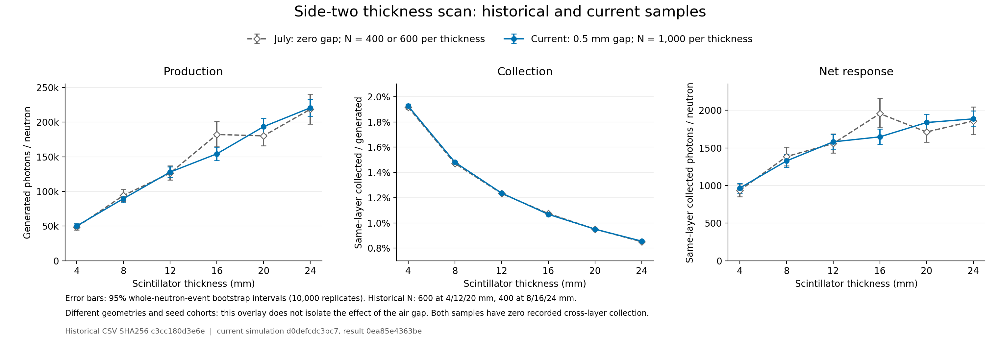

# Side-two thickness scan: historical and current summaries



[Vector PDF](side-two-comparison.pdf) · [Exact CSV values](comparison.csv) ·
[Source comparison JSON](comparison.json)

This is a **descriptive overlay**, published before a new check of the historical
raw event files. It compares the July zero-gap, ten-layer side-two summary with
the current side-two sample using nine 0.5 mm inter-module gaps. Side-two means
two sensors on the same +X face of each whole scintillator tile.

The original PNG, PDF, CSV, and JSON are preserved byte for byte. The JSON's
absolute source paths are provenance text from the original preparation; the
portable replot command below never opens those paths.

## What the three panels mean

For each thickness, let **N** be the number of incident neutrons, **G** the total
recorded generated optical photons, and **D_local** the total photons collected
by sensors on their originating tile. Define:

- Production: **P = G / N**.
- Collection: **eta = D_local / G**, a ratio of totals, not the mean of per-event efficiencies.
- Net response: **R = D_local / N**.

The point estimates obey the exact identity **R = P × eta**. The comparison
preparation checked that both supplied summaries have zero recorded cross-layer
collection, so the current total-D response equals its same-layer response here.
That summary check is not a new audit of the historical ROOT files. Separately
reported confidence-interval endpoints must not be multiplied as if independent.

From **16 mm to 20 mm**, the relative point-estimate changes are:

| Sample | Production P | Collection eta | Net response R |
|---|---:|---:|---:|
| July zero-gap | −1.1% | −11.5% | −12.5% |
| Current 0.5 mm gap | +25.4% | −11.0% | +11.6% |

Changes use `100 × (value_at_20_mm / value_at_16_mm − 1)`, before rounding.
Thus the different net-response direction in these summaries comes algebraically
from their different production changes, while collection falls by about 11% in
both. This decomposes the plotted point estimates; it does not establish why the
underlying production samples differ.

At matched thicknesses, the absolute relative difference in collection,
`abs(eta_current / eta_July − 1)`, is at most **0.641%**, below **0.7%**.
This descriptive agreement is not a statistical equivalence result.

## Scope and recovered evidence

Historical sample sizes are **600** neutrons at 4/12/20 mm and **400** at
8/16/24 mm; the current sample has **1,000 per thickness**. Displayed intervals
are the supplied 95% whole-neutron-event bootstrap intervals with 10,000
replicates. The geometries and seed cohorts differ, and the sample sizes are
unequal. This overlay cannot isolate an air-gap effect or establish an optimal
scintillator thickness.

The current thickness-to-thickness contrasts retained in the JSON are
**exploratory, unadjusted descriptive comparisons**. They are outside the
18 preregistered layout contrasts of the formal current scan.

**The follow-up historical raw-event audit is now complete:**
[recovered ROOT evidence and retrospective diagnostics](raw-event-audit/README.md).
All 30 ROOT files match their original checksums and reproduce the six historical
points. That follow-up also records dataset-version differences and exploratory
contrast intervals. The original overlay JSON retains
`historical_raw_ROOT_rechecked_here: false` because it was prepared before this
audit; its values and original confidence intervals have not been rewritten.

Source identities:

- Historical summary CSV SHA-256:
  `c3cc180d3e6eb307ee81face100e2633a16ae489aaac7d4beb160e3e90a5d961`.
- Current accepted result JSON SHA-256:
  `0ea85e4363beb04e4a29ef0e382d110994bd12c5667c780f0f01e47c5dbeb6ba`.
- This comparison JSON SHA-256:
  `d680479db173030b96d4fb02d77ee489d20ff24f421e577031ae81e4938b1870`.

## Replot without ROOT or the original source directories

Use an isolated Python environment with the repository's
[plotting requirements](../../requirements-plot.txt). From the repository root:

```sh
python -m pip install -r tools/layout_study/requirements-plot.txt
python tools/layout_study/results/side-two-history-comparison/compare.py \
  --comparison tools/layout_study/results/side-two-history-comparison/comparison.json \
  --comparison-sha256 d680479db173030b96d4fb02d77ee489d20ff24f421e577031ae81e4938b1870 \
  --output outputs/side-two-comparison-replot
```

The output directory must be new. The script validates the complete two-sample,
six-thickness table, unequal event counts, finite interval endpoints and exact
net-response identity. It redraws the existing summary values and bounds; it
never reads ROOT or bootstrap arrays, recalculates intervals, or starts a
simulation. It emits PNG/PDF, a JSON copy, the exact table as CSV, and a render
metadata file with source/program/output hashes and plotting versions.

The preserved published images are the original render. The portable replot uses
the same summary values and panel scales with provenance drawn directly from the
JSON; rendering metadata, interval cap geometry and the provenance footer may
differ. Numerical tables are the authority for exact values.
