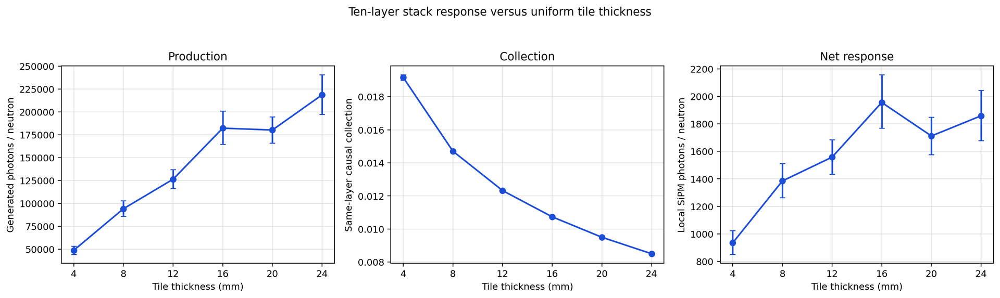

# July side-two ROOT recovery and retrospective diagnostics

The 30 historical ROOT files were recovered from OSC on 2026-10-03. Their
checksums and freshly repeated legacy event audits match the sealed records.
All six historical production, collection and net-response point estimates are
reproduced exactly. This validates the data behind the July figure; it does not
establish 16 mm as the optimal thickness or identify the cause of the difference
from the current scan. **No new Geant4 events were generated.**



The image above is the supplied original, copied without editing. See the
[July/current overlay](../README.md) for the comparison. Thickness is the
**scintillator tile** thickness; all ten steel plates remain 40 mm thick.

## Recovered evidence

[Independent recovery proof](recovery-proof.json) checks the recovery archive,
441 indexed files, 30 task/configuration identities and 60 unique seeds, each
ROOT against its original selected-task checksum, and all 30 event audits using
the unchanged July auditor. Its module hashes are recorded in the proof.
The historical simulation source is `ca276b4d3f9c96d2a7a50e852216f805d66decf6`;
`a2d05dfe` is the selected final-report baseline, not a different simulation.

The archive includes 24 pilot tasks and 6 production tasks, each with 100
incident neutron events. The combined sample has 600 events at 4/12/20 mm and
400 at 8/16/24 mm. Three explanatory Markdown files were not copied (two
campaign READMEs and a cumulative summary); the numerical records and sealed
checksum lists used by this audit were recovered and checked.

- [Historical summary CSV](historical-thickness-summary.csv), preserved exactly.
- [All 3,000 old event diagnostics](old-event-diagnostics.csv).
- [30 old and 60 current side-two block diagnostics](block-diagnostics.csv).
- [Original archive file index](recovery-index.json), [receipt](recovery-receipt.json)
  and [independently reconstructed seed plan](reconstructed-seed-plan.json).
- [Full retrospective result](retrospective-result.json),
  [bootstrap arrays](retrospective-bootstrap.npz),
  [program](retrospective.py) and [validation record](retrospective-validation.json).

The ROOT archive itself is retained on OSC and locally, rather than included in
this Git package. Full ROOT-level reruns require access to that archive; the
published CSVs, result JSON and bootstrap arrays are available from this branch.
The archive is 7,767,791 bytes (442 files including its own index), SHA-256:
`b9685f399946d5df6eec609a7b3e429cb8a1a01f92d9715f25ccf41b6116882c`.

OSC location:

```text
/users/PAS2524/anolddriver66/g4optics-rn/layout-study-pr6/old-root-recovery-20261003/historical-root-evidence.tar.gz
```

## What the recovered events support

These are **new, post-hoc, exploratory comparisons**, selected after looking at
the July 16 mm maximum. Intervals are unadjusted descriptive 95% percentile
intervals; they are not multiplicity-adjusted tests and do not replace the
original figure's intervals or the current study's 18 preregistered contrasts.

| Historical local response contrast | Difference (photons/neutron) | Descriptive 95% interval |
|---|---:|---:|
| 16 minus 20 mm | +243.92 | [+12.54, +482.67] |
| 16 minus 24 mm | +97.13 | [−165.65, +366.07] |

The selected 16-versus-20 interval lies above zero under this method. The
16-versus-24 interval includes zero. These results do not establish a unique
optimum; overlapping marginal error bars alone were not used to decide this.

The largest 16 mm event is `stack-pilot-t16-b000`, event 42: 13,298 locally
collected photons, **1.6996%** of the thickness sample's total. Omitting this
single event only for sensitivity gives 1,927.59 photons/neutron, compared with
the full estimate 1,956.01. Thus a single event alone does not account for the
point-estimate ranking. The four 100-event block means are 2,275.55, 1,618.81,
1,766.77 and 2,162.92. Omitting the **highest-response 100-event block** gives
1,849.50, slightly below the full 24 mm mean of 1,858.89. This demonstrates
sensitivity of that ranking to the sampled blocks. **No observations were
removed from any reported full-sample estimate**, and these checks do not
identify an outlier, a simulation defect, or a noise-only explanation.

At 16 mm, the July/current comparison gives:

| Observable per incident neutron | July | Current | July relative to current; descriptive 95% interval |
|---|---:|---:|---:|
| Generated optical photons | 182,182.12 | 154,261.96 | +18.10% [ +4.75%, +32.62% ] |
| Locally collected photons | 1,956.01 | 1,647.26 | +18.74% [ +5.22%, +33.51% ] |
| Tile energy deposit (MeV) | 25.2070 | 21.5337 | +17.06% [ +3.73%, +31.62% ] |
| Collection ratio of totals | 0.0107366 | 0.0106783 | +0.55% [ −0.25%, +1.48% ] |

This locates the observed response difference mainly alongside production and
tile energy deposition, with no clearly resolved collection difference in this
exploratory interval. It does not identify a physical or statistical cause.
The legacy generated-photon counter is the historical denominator, not a full
optical-photon birth/fate ledger; these are photon counts, not photoelectrons.

## A recovered environment difference

[Source and runtime identities](source-identities.json) and the independent proof
show that both records say Geant4 11.4.2, but their sealed dataset manifests list
different versions in five families:

| Dataset family | July recorded tree | Current recorded tree |
|---|---|---|
| G4EMLOW | 8.6.1 | 8.8 |
| G4PARTICLEXS | 4.1 | 4.2 |
| PhotonEvaporation | 6.1 | 6.1.2 |
| G4INCL | 1.2 | 1.3 |
| G4CHANNELING | 1.0 | 2.0 |

The 25,337 common exact paths have matching file hashes. Version-normalized
family differences include added tables, changed tables, and documentation;
see the proof for the counts. The historical launcher could preserve existing
`G4*DATA` variables before searching the mounted data tree, and recovered logs
do not enumerate all resolved dataset paths. **A manifest difference does not
prove which changed files any process used, or that those files caused the
response difference.** The old dataset payload and SIF were not recovered in
this audit; their frozen receipts were. Different SIF hashes alone cannot
identify a physics difference inside the containers.

Consequently this is not a controlled gap-only comparison: source/executable,
seed cohorts, event counts and recorded environment differ as well. At 16 mm
the zero-gap core is 560 mm and the current core is 564.5 mm; the source remains
1.5 mm upstream of each core. The current geometry adds nine 0.5 mm internal
gaps. A causal gap study would hold the runtime/data and other model settings
fixed and vary the gap explicitly. No such additional simulation is claimed
or started here.

## Reproduce this retrospective analysis

Use `numpy==2.0.2` and `uproot==5.6.9` from
[the analysis requirements](../../../requirements.txt). This diagnostic run
used Python 3.12.14 locally. After obtaining and checksum-verifying the old ROOT
bundle, extract it into `outputs/july-root-recovery`. Also obtain the accepted
current campaign including its ROOT files, receipts, result JSON and saved
bootstrap arrays. Its frozen source is
`d0defcdc3bc7513b4feccdaa64a4512ea621c797`; the accepted result JSON SHA-256 is
`0ea85e4363beb04e4a29ef0e382d110994bd12c5667c780f0f01e47c5dbeb6ba`.

From the repository root, with that current campaign at
`outputs/current-campaign` and a fresh output filename:

```sh
python tools/layout_study/results/side-two-history-comparison/raw-event-audit/retrospective.py \
  --old-root outputs/july-root-recovery \
  --old-summary tools/layout_study/results/side-two-history-comparison/raw-event-audit/historical-thickness-summary.csv \
  --old-index outputs/july-root-recovery/campaigns/steel-module-stack-pilot-ca276b4d-b100/finalized/task_index.tsv \
  --old-index outputs/july-root-recovery/campaigns/steel-module-stack-production-ca276b4d/finalized/task_index.tsv \
  --current-campaign outputs/current-campaign \
  --output outputs/july-retrospective-rerun.json
```

The program verifies ROOT hashes and event/layer identities and reproduces the
historical summary. It resamples pooled whole neutron events independently
within each historical thickness, with shared weights across observables:
10,000 replicates, `SeedSequence(2026100307).spawn(6)`, thickness order
4/8/12/16/20/24 mm. Collection is a ratio of resampled totals. The old/current
16 mm contrast combines independent new historical draws with the current
campaign's already saved draws; matching replicate indices do not pair events.
Original July intervals used seed 20260715 and remain preserved separately.

The final non-BLAS reduction produced arrays exactly equal to the initial
reduction, whose local library emitted floating-status warnings despite finite
outputs. Both diagnostic attempts are retained locally; the published `r2`
result and validation record identify the final method. The validation record's
phrase “registered random weights” means identical retrospective draws, not a
preregistered scientific analysis. CSV diagnostic line endings were normalized
to LF for Git; original summary, JSON, NPZ and image bytes were preserved.
Absolute input paths in evidence JSONs are provenance and need not exist on a
reviewer's computer. Input locations/Python version can change provenance text
on rerun; compare numerical arrays and estimates, not the whole result JSON hash.
